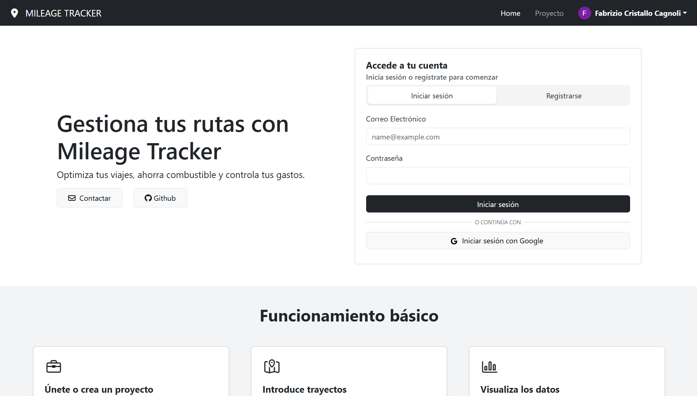
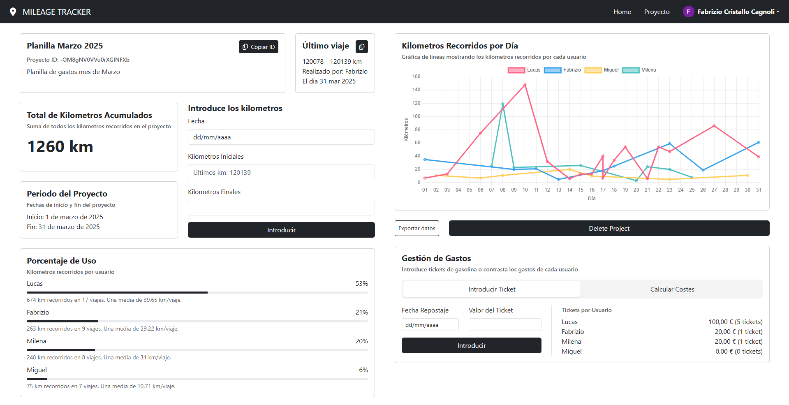

# Mileage Tracker

**Mileage Tracker** es un proyecto que surge para dar solución a una situación personal en la que se debe gestionar los gastos de un coche compartido por varias personas. 

El proyecto constituye una aplicación web que permite registrar viajes realizados por varios usuarios, así como los tickets de repostaje aportados por cada uno de ellos. De esta manera, se puede llevar un control sencillo de los gastos y el kilometraje recorrido.

## Funcionalidades

La aplicación presenta diferentes características, entre las que se incluyen:

- Autenticación de usuarios mediante correo electrónico o Google.
- Creación de proyectos o posibilidad de unirse a proyectos existentes.
- Añadir viajes a los proyectos.

- Visualización gráfica de los kilómetros realizados por dia por cada usuario.
- Visualización del porcentaje de uso de cada usuario.
- Registro de tickets de repostaje de gasolina
- Calculadora de gastos por usuario basada en el kilometraje total y el coste total aportado de gasolina.
- Posibilidad de exportar los datos de los viajes a un archivo CSV.

## Tecnologías utilizadas

La aplicación ha sido desarrollada utilizando únicamente Angular 19 y Firebase. Para la visualización de los gráficos se ha utilizado un componente de [PrimeNG](https://www.primefaces.org/primeng/), que utiliza [Chart.js](https://www.chartjs.org/) para la generación de los gráficos [^1].

De Firebase se han utilizado los siguientes servicios:

- **Authentication:** para la autenticación de los usuarios mediante varios proveedores de acceso.
- **Realtime Database:** para el almacenamiento de los datos.
- **Hosting:** para el despliegue de la aplicación.

[^1]: Queda pendiente eliminar la dependencia de PrimeNG y utilizar directamente Chart.js para la generación de los gráficos.
